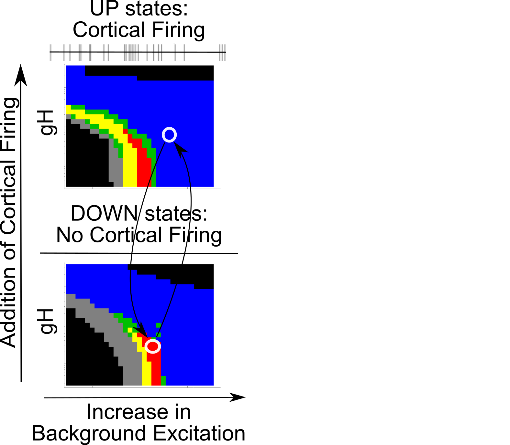
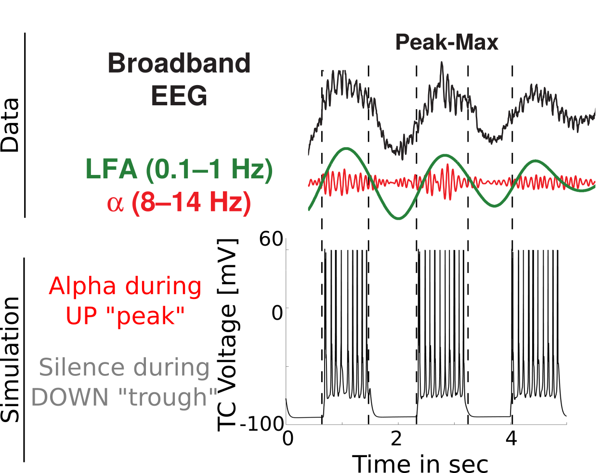
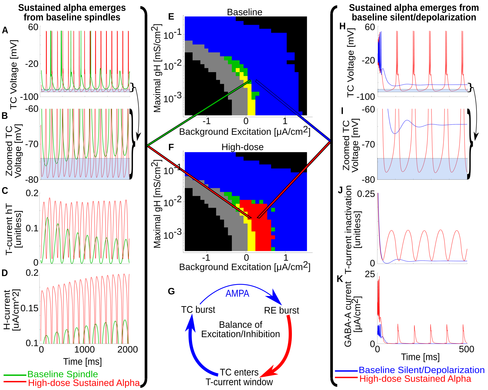

Background / Methods
==============================================================================

## Propofol Alpha and Slow Wave

{ width=100% 
}

## Why do we care?

- Better understanding of propofol mechanisms could lead to more targeted 
  anesthetics

- Clarify mechanistic differences between between anesthesia and sleep, 
  including rhythms

- Propofol coupling correlates with depth of anesthesia, as can be used in the 
  Operating Room
    - Coupling mechanisms may tie to specific aspects of loss of consciousness

## Sleep Spindles vs Propofol Alpha

{ 
width=100% }

## Propofol Mechanisms of Action

1. **Increases** $GABA_A$ **inhibition**:
    - Increases max synaptic conductance (**$\uparrow \bar g_{GABA_A}$**  )
    - Increases decay time constant (**$\uparrow \tau_{GABA_A}$**  )

2. **Decreases thalamocortical (TC) cell H-current conductance ($\downarrow \bar g_H$  )**

3. **Decreases Excitation from brainstem** ($\downarrow I_{applied}$)

## Our Model Thalamus

{ width=80% }

Overview
==============================================================================

## Overview

1. **Increase of $GABA_A$ and decrease of TC cell H-current are required for 
   thalamic Alpha oscillations**

2. Thalamic Alpha oscillations are sustained spindles

3. Interaction between thalamic Alpha and Slow Wave Activity can produce 
   propofol phase-amplitude coupling regimes

$GABA_A$ and H-current changes are required for thalamic Alpha oscillations
==============================================================================

## Native hyperpolarized thalamus cannot produce Alpha oscillations

{ width=75% }

## Simulating $GABA_A$ increase enables thalamic Alpha oscillations

{ width=55% }

## Alpha requires H-current decrease

{ 
width=65% }

## Summary So Far

- Sustained Alpha does *not* occur normally

- **$GABA_A$ increase** is a necessary factor for sustained Alpha

- **TC cell H-current decrease** is also a necessary factor for sustained Alpha

## Overview So Far

1. Increase of $GABA_A$ and decrease of TC cell H-current are required for 
thalamic Alpha oscillations

2. **Thalamic Alpha oscillations are sustained spindles**

3. Interaction between thalamic Alpha and Slow Wave Activity can produce 
propofol phase-amplitude coupling regimes

Thalamic Alpha oscillations are sustained spindles
==============================================================================

## Sustained alpha emerges from Baseline spindles

{ width=90% }

## Summary So Far

- Propofol thalamic alpha takes advantage of thalamic spindle dynamics (e.g. 
  $T_{window}$)

- Enhanced *inhibition* enables *more* spiking/oscillating due to T-current and 
  H-current interplay

## Overview So Far

1. Increase of $GABA_A$ and decrease of TC cell H-current are required for 
thalamic Alpha oscillations

2. Thalamic Alpha oscillations are sustained spindles

3. **Interaction between thalamic Alpha and Slow Wave Activity can produce 
propofol phase-amplitude coupling regimes**

Alpha-SWO Coupling
==============================================================================

## Slow Wave Oscillations

{ 
width=100% }

## Phase-amplitude Coupling Switches

{ width=70% 
}

## Our Full Model Network

{ 
width=60% }

## Simulating UP vs DOWN states

{ 
width=70% }

## Simulating UP vs DOWN states

{ 
width=70% }

## Trough-max thalamic alpha

{ 
width=70% }

## Trough-max comparison
{ 
width=70% }

## Peak-max thalamic alpha

{ width=70% }

## Peak-max comparison

{ 
width=70% }

## Coupling Summary So Far

- Given SWO UP/DOWN transitions coming from cortex to thalamus,

    1. **"trough-max" Alpha can be generated during DOWNs by the thalamus**

    2. **"peak-max" Alpha can be generated during UPs by the thalamus**

- **Overall thalamic hyperpolarization** is the critical factor for switching
  the thalamus between trough-max and peak-max

Conclusions
==============================================================================

## Conclusions 1

1. Propofol sustained alpha may come from its **$GABA_A$ increase** and 
  **H-current decrease** in the thalamus.

2. This propofol alpha is dependent on the **spindling dynamics** of the 
   thalamus.

## Conclusions 2

3. During **"trough-max"** propofol coupling, the thalamus may cause 
   the sustained Alpha in the DOWN/trough phase. Similarly, in **"peak-max"**
   coupling, the thalamus may cause the sustained Alpha seen during 
   the UP/peak phase.

4. **Increased hyperpolarization** of the thalamus is sufficient to switch 
   from trough-max thalamic firing to peak-max thalamic firing, and vice versa.

## Implications

- Propofol alpha may arise from the thalamus.

- Hyperpolarization level of the thalamus may determine which coupling regime 
  is present (trough-max or peak-max), and may be controlled by specific 
  brainstem nuclei.

- Since propofol alpha is not present during trough-max UP states, there may 
  still be corticothalamic *communication* during trough-max.

## Acknowledgements

- Kopell Lab @ BU: Nancy Kopell, Michelle McCarthy, Jason Sherfey, Erik 
  Roberts, alums Shane Lee, ShiNung Ching, Sujith Vijayan
- CRC community
- BU Graduate Program for Neuroscience, especially Shelley Russek and Sandi 
  Grasso
- Anesthesia research @ MIT: Emery Brown lab, Patrick Purdon lab, Christa van 
  Dort lab, Ken Solt lab
- NIH, NSF, and HHS for funding including training

## Simulation Code

Our lab uses and develops the [DynaSim 
Simulator](https://www.github.com/dynasim/dynasim) originally created by Jason 
Sherfey. All the code necessary to run these simulations [is available on 
GitHub here](https://github.com/asoplata/propofol-coupling-2017-mechanisms)!

{ width=100% }

Appendix
==============================================================================

## Detail: $T_{window}$ is critical

{ width=85% }

## Detail: Propofol Alpha mechanism

{ width=75% }

References
==============================================================================

## CSS

## 
