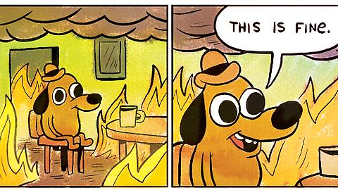

## Sleep-Stage-Specific Regulation of Cortical Excitation and Inhibition

Niels Niethard, Masashi Hasegawa, Takahide Itokazu, Carlos N. Oyanedel, Jan
Born, Takashi R. Sato

# Background

##

### Sleep: *Slow-Wave Sleep* (SWS)

Since the second-order headers act as slide titles, 
BUT since they are

1. same size as first-order headers, which are HUGE, and
2. in all caps (???)

You can instead create a slide with an "empty" title via a blank second-order
header, and then use something smaller like a fourth-order header to fake the
title of the slide

##

### Sleep: *Rapid-Eye Movement* (REM) Sleep 

- is list content centered or leftward oriented
  - sublist
    - subsublist

### third order header

# Results: *Calcium imaging*

##

# Results: *2-Photon Imaging*

# Conclusions

# References

##

1. le paper
2. Brown, E. N., & Schiff, N. D. (2010). General anesthesia, sleep, and
   coma. New England Journal of Medicine, 363(27), 2638–2650.
