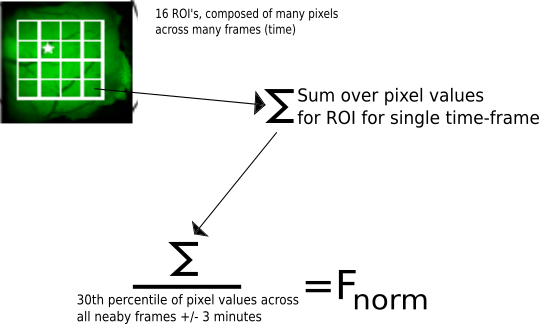

## Sleep-Stage-Specific Regulation of Cortical Excitation and Inhibition

[@niethard_sleep-stage-specific_2016]

# Background

##

### Sleep

![[@brown_general_2010] Fig 1C](figures/brown-2010-fig1c.png){ width=60% }

## 

### Sleep Rhythms

- Slow-Wave Sleep (SWS)
    - Slow Waves/"Delta" waves:  0.5-4 Hz
    - Sleep spindles: 10~15 Hz
- Rapid-Eye Movement (REM) Sleep
    - Theta waves: 4-7 Hz

# Results: *Dorsal PY Activity*

##

### Results: *Dorsal PY Activity*

![[@niethard_sleep-stage-specific_2016] Fig
1A](figures/niethard-2016-fig1a.png){ width=60% }

##

### Results: *Dorsal PY Activity*

- (Show Movie 1)

##

### Results: *Dorsal PY Activity*

![[@niethard_sleep-stage-specific_2016] Fig
1b-f](figures/niethard-2016-fig1b-f.png){ width=70% }

##

### Results: *Dorsal PY Activity*

##

### Results: *Dorsal PY Activity*

- Main point: activity was maximal in wake, reduced in SWS, and, *contrary to
  expectations*, minimal in REM

# Results: *Deep/Superficial Injections*

##

### Results: *Superficial Injections*

![[@niethard_sleep-stage-specific_2016] Fig
2a-d](figures/niethard-2016-fig2a-d.png){ width=70% }

##

### Results: *Deep Injections*

![[@niethard_sleep-stage-specific_2016] Fig
2e-h](figures/niethard-2016-fig2e-h.png){ width=70% }

##

### Results: *Deep/Superficial Injections*

- Main point: the same decreasing activity level through wake->SWS->REM was seen
  in both superficial and deep layers of sensorimotor cortex.

# Results: *PV-/SOM-Cre vs Total Activity*

##

### Results: *PV-Cre Mouse*

![[@niethard_sleep-stage-specific_2016] Fig
3a-d](figures/niethard-2016-fig3a-d.png){ width=70% }

##

### Results: *PV-Cre vs Total Activity*

![[@niethard_sleep-stage-specific_2016] Fig
3e](figures/niethard-2016-fig3e.png){ width=70% }

##

### Results: *PV-/SOM-Cre vs Total Activity*

![[@niethard_sleep-stage-specific_2016] Fig 4](figures/niethard-2016-fig4.png){
width=60% }

##

### Results: *PV-/SOM-Cre vs Total Activity*

"These data demonstrate the specific activation of PV-INs during REM sleep,
which is accompanied by the suppression of both pyramidal neural and SOM-IN
activity...[This] suggests that the shift in the overall excitation/inhibition
balance toward predominant inhibition during REM sleep is conveyed by a
**subset** of REM sleep-active PV-INs."

##

### The elephant in the room: REM should be MORE active than SWS!

##

### Results: *PV-/SOM-Cre vs Total Activity*

![[@niethard_sleep-stage-specific_2016] Fig 5](figures/niethard-2016-fig5.png){
width=60% }

##

### Results: *PV-/SOM-Cre vs Total Activity*

- They blame selection bias: "neurons that are active during the wake period
  might be more likely to be selected for extracellular recordings...and only
  those neurons might also show higher activity during REM sleep than SWS."
- "Overall, these data indicate that neurons with higher activity during wake
  also show higher activity during REM sleep, compared to SWS" -- this includes
  unlabeled cells, probably including PYs!

# Results: *Exc/Inh Co-activation*

##

### Results: *Exc/Inh Co-activation*

![[@niethard_sleep-stage-specific_2016] Fig 6](figures/niethard-2016-fig6.png){
width=80% }

##

### Results: *Exc/Inh Co-activation*

- They claim this is accounted for by lower firing rates in REM because the rank
  correlation coefficients for the most active 20% of PY cells also showed
  significantly reduced correlations in SWS and REM compared to wake (data not
  shown).
- "PV-INs and SOM-INs tend to be co-activated with pyramidal cell during wake,
  [but] during sleep...activity of inhibitory and excitatory cells becomes
  dissociated."

# Conclusions

##

### Conclusions

- They found global cortical activity decreases progressively from wake, to SWS,
  to REM.
    - This was the case for PY and SOM-IN cells in general, and was the case for
      cells in both superficial and deep layers.
- "PV-INs with the highest activity during wakefulness also showed highest
  activity during REM sleep, and the same relationship was observed for PY cells
  and SOM-INs, although less pronounced."
    - Therefore, it's possible that prior REM studies indicating greater activity
      than SWS are biased in favor of these 80~95% percentile-active cells

##

### Conclusions

- They theorize that both
    - The balance of excitation/inhibition shifts towards inhibition in sleep,
      particularly in REM
    - Inhibitory cells become much more "dissociated" from excitatory activity
      in sleep, particularly in REM

# References

##
